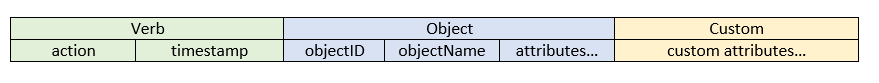

# @sap/audit-logging

Provides audit logging functionalities for Node.js applications.


## Overview

Audit logging is about writing entries in a specific format to a log storage. Subject to audit logging are events of significant importance.
For example, security events which may impact the confidentiality, the integrity or the availability of a system.
Another example of such an event would be access to sensitive personal data (both reading and altering) like bank accounts, political opinion,
health status etc.

While the consumer of ordinary logs is a system administrator who would like to keep track of the state of a system,
audit logs are read by an auditor. There are legal requirements (in some countries stricter than in others) regarding audit logging.

In general the events that are supposed to be audit logged can be gouped in 3 main categories:
- changes to system configurations (which may have significant effect on the system itself)
- access to sensitive data (related to data privacy)
- general security events (like starting/stopping a system, failed authorization checks etc.)


### General audit logging principles

- All attempts to perform an action in a system should be audit logged no matter if they have been successful or not.
- Audit log entries should be consistent with the state of the system. If, for example, the writing of the audit log entry fails,
but the changes to system critical parameters have been applied, then those changes should be reverted. Best practice is to wait for
the callback of the logger before continuing with the execution of other code.
- Especially important is which user (or other agent) has triggered the corresponding event that is being audit logged.
For most of the cases the library will validate that such a field is provided in the message.
- All audit log entries should be in English. Numbers should be converted to strings with English locale.
All time fields should be in UTC time in order to avoid timezone and day light saving time issues.
- Passwords should never be audit logged.


## Message format

An audit log entry may contain the following parts:



- Verb - contains the action that was performed, e.g. _create_, _read_, _update_, _delete_
and the UTC time the message has been created at.

- Object - contains the information about the object the action has been performed on. The _objectID_ is a mandatory field.
It is a unique indetifier of the object (e.g., primary key for an entry in a database). _objectName_ is the display name
of the object. The library treats this field as optional. The object part may also contain the attributes of the object on which the action has been performed.
If none are provided, then it should be considered that the action has been performed over the whole object. For example, if the action is _read_ and the object is _user with id 123_,
and if the attribute _birthday_ is provided, then it is considered that only this attribute of the user has been read.
If no attributes are provided, then it is assumed that all the user data has been read.

- Custom - contains name-value pairs which add additional context to the audit log message. For example, the user who performed the action,
the category of the message, access channel from which the operation has been triggered etc. Application developers can add their own custom attributes as well.


## API

The library provides an API for writing data access event entries of type _create_, _read_, _update_, _delete_.
This general mechanism can be used for entries for any kind of data and can be further classified (e.g. as system configuration)
via a _category_ which can be specified as a custom attribute.

The library also provides an API for general security messages.


### Importing the library

```js
var auditLog = require('@sap/audit-logging');
```

The `auditLog` object contains the following functions:

Function        | Purpose
--------------- | -------
create          | Used to create an entry for a _create_ operation.
read            | Used to create an entry for a _read_ operation.
update          | Used to create an entry for an _update_ operation.
delete          | Used to create an entry for a _delete_ operation.
securityMessage | Used to create a general security audit log message.


### Data access messages

Such messages are logged when a specific action (_create_, _read_, _update_ or _delete_) is performed on some data.

- Basic usage

Let's suppose we need to create an entry for a _read_ operation over user data. We can achieve that with the following code:

```js
auditLog.read('123', 'John Doe')
  .attribute('First name', 'John')
  .attribute('Last name', 'Doe')
  .attribute('Birth date')
  .by('John Doe')
```

The `attribute` method sets object attributes. If it is considered that the birth date is too sensitive to be present in the audit logs, the value of the attribute can be left unspecified.
If no attributes are specified, it is assumed that all user data has been read.

It is important to specify which is the driver of the action. The library will enforce it for all the functions of the `auditLog` object named after an action.
Setting it can be achieved with the `by` method. In this case John Doe has read his own user info. The entry that will be produced would look like the following:

> verb={"action":"read","timestamp":"2016-03-24T14:07:05+00:00"},object={"objectID":"123","objectName":"John Doe","objectAttributes":{"First name":"John","Last name":"Doe","Birth date":"n/a"}},custom={"driver of action":"John Doe"}

_n/a_ is used in case object attribute value is not specified.


In that example we set the custom attribute 'driver of action'. This is one of the [predefined custom attributes](#predefined-custom-attributes) for which there is a dedicated method.
It is also possible to set your own custom attribute, like that:

```js
auditLog.read('123', 'John Doe')
  .attribute('First name', 'John')
  .attribute('Last name', 'Doe')
  .attribute('Birth date')
  .by('John Doe')
  .customAttribute('my custom attribute', 'my value')
```

Now the message would look like:

> verb={"action":"read","timestamp":"2016-03-24T14:12:13+00:00"},object={"objectID":"123","objectName":"John Doe","objectAttributes":{"First name":"John","Last name":"Doe","Birth date":"n/a"}},custom={"driver of action":"John Doe","my custom attribute":"my value"}

- Configuration related messages

In this case the `category` method can be used (this is also one of the [predefined custom attributes](#predefined-custom-attributes)) to add more context information to the message:

```js
auditLog.read('001122', 'application configuration')
  .category('configuration')
  .attribute('session timeout', 25)
  .by('Application Admin')
```

The resulting message would look like:

> verb={"action":"read","timestamp":"2016-03-24T18:11:13+00:00"},object={"objectID":"001122","objectName":"application configuration","objectAttributes":{"session timeout":"25"}},custom={"category":"configuration","driver of action":"Application Admin"}

- Messages for _update_ operations

When creating an entry for an _update_ action it is possible to specify the old and the new value of an object attribute:

```js
auditLog.update('001122', 'application configuration')
  .category('configuration')
  .attribute('session timeout', 25, 40)
  .by('Application Admin')
```

The entry would look like this:

> verb={"action":"update","timestamp":"2016-03-24T16:19:27+00:00"},object={"objectID":"001122","objectName":"application configuration","objectAttributes":{"session timeout":{"oldValue":"25","newValue":"40"}}},custom={"category":"configuration","driver of action":"Application Admin"}

_Note_: the library throws an error if specifying an old value and a new value of an attribute for an action different from _update_.

- Unsuccessful attempts to perform an action

It is also important to create entries for unsuccessful attempts to perform an action. Here is an example how to do so:

```js
auditLog.delete('123', 'John Doe')
  .by('An unauthorized user')
  .successful(false)
```

This example shows how to build an audit log message for the case in which the user _An unauthorized user_ has tried to delete all the data for a _user with id 123 (John Doe)_,
but the operation has not been successful. Unsuccessful operations are marked as _attempts_ in the entries and in this example the action would be '_delete-attempt_' instead of just '_delete_'.
By default operations are marked as successful. To change that use the `successful` method. The example entry would look like this:

> verb={"action":"delete-attempt","timestamp":"2016-03-24T16:38:31+00:00"},object={"objectID":"123","objectName":"John Doe"},custom={"driver of action":"An unauthorized user"}

### General security messages

Those can be created like this:

```js
auditLog.securityMessage('%d unsuccessful login attempts', 3).by('John Doe')
  .customAttribute('user status', 'blocked')
```

The entry would look like:

> verb={"action":null,"timestamp":"2016-03-24T17:13:10+00:00"},custom={"message":"3 unsuccessful login attempts","driver of action":"John Doe","user status":"blocked"}

Note that in this case the action is 'null' and there is no 'object' part in the message.
In the `securityMessage` function you may use the same string interpolation mechanism as with [util.format](https://nodejs.org/api/util.html#util_util_format_format).

#### Predefined custom attributes

The custom part of an audit log message contains name-value pairs which can be used to attach additional context of the message.
There are several methods (avaialble for both data access messages and general security messages) which can be used to set some commonly used custom properties:

Method          | Custom property name | Purpose
--------------- | -------------------- | --------
by              | driver of action     | States which is the agent that triggered the operation.
accessChannel   | access channel       | States how the data (or the system itself) is being accessed (e.g. RFC, Web services, UI).
externalIP      | external IP          | States the IP of the machine that contacts the system.
category        | category             | Adds a category to the message.

### Logging a message

Use the `log` method to actually log a message. It takes one argument, a callback function. Be aware that the state of the audit logs should be consistent
with the state of the system. Make sure you handle errors from the audit log writer properly. Best practice is to wait for the logging to finish before executing other code.

```js
auditLog.create('001122', 'some configuration')
  .category('configuration')
  .by('Application Admin')
  .log(function (err) {
    // Place all of the remaining logic here
  });
```

The same function (`log`) is used for general security messages as well.

## Logs storage

There are several possibilities for storage. The following two environment variables (set by the XS Advanced OnPremise Runtime) are taken into account:

- _XS_AUDIT_LOG_FILE_ - which holds the path to an audit log file
- _XS_AUDIT_TO_SYSLOG_ - which holds a boolean value taken from the audit log setting of the xs-controller

_XS_AUDIT_TO_SYSLOG_ has the highest priority. If it is set to 'true', then the library will sent the audit log entries to Syslog (or Event Log on Windows).
To achieve that the `sap_syslog` module (part of SAP Node.js) should be present in the currently used Node.js runtime, otherwise an error is thrown.

If _XS_AUDIT_LOG_FILE_ is provided and _XS_AUDIT_TO_SYSLOG_ is set to 'false' (or is missing), then the entries will be stored in the _XS_AUDIT_LOG_FILE_.

If those environment variables are not set (e.g. in Cloud Foundry scenarios or local development), then the entries will be sent to the console.
The console will be used as well if _XS_AUDIT_TO_SYSLOG_ is set to 'false' and there is no _XS_AUDIT_LOG_FILE_ provided.

In case Syslog is used as a storage (or Event Log on Windows): If your application is running on the XS Advanced OnPremise Runtime (or Cloud Foundry)
the component name used is taken from the environment (the _application_name_ property in the _VCAP_APPLICATION_ environment variable).
If running the application locally, then the entries will be logged with '_sap-nodejs-audit-logging_' as a component name.
